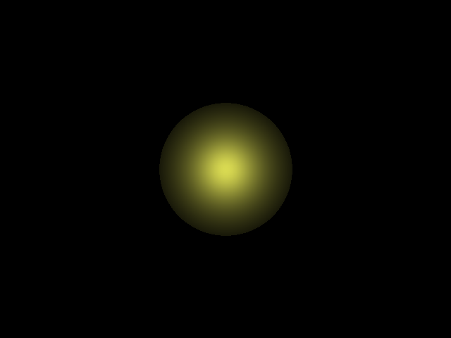

# Ray-Tracing-0                                       
This is  a minimal implementation of ray tracing.                      

The output is like this:                                         

To save the RGBA values into an image file, I used the [lodePNG](http://lodev.org/lodepng) library.
