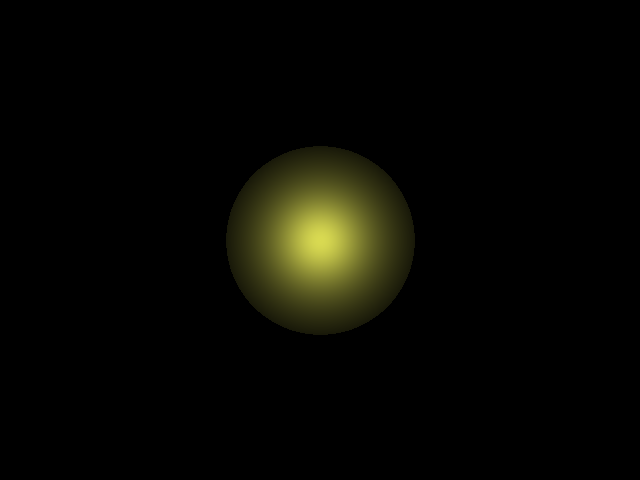
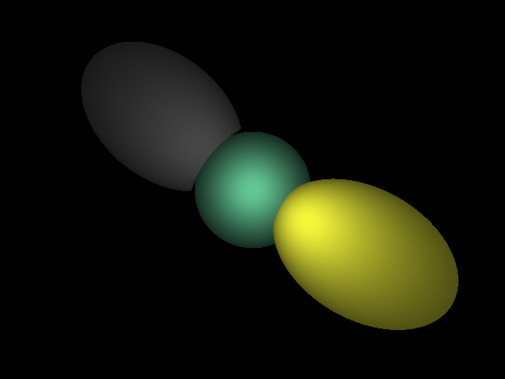

# Ray-Tracing-0

This repository contains some demos of ray tracing implemented by me.                                       
It's my first time to learn ray tracing from scratch, so I'm going to use this repository to record my implementations of different features.  
                                                    
* General:                               
To save the RGBA values into an image file, I used the [lodePNG](http://lodev.org/lodepng) library.                     
To calculate the intersection between rays and sphere, I referred [this](https://www.siggraph.org/education/materials/HyperGraph/raytrace/rtinter1.htm).
                                 
                                                 
                                                 
* Demo 1:                      
This is a minimal implementation of ray tracing with only one sphere. No relection and refraction is used.                               
The output is like this:                                         
                                

* Demo 2:                   
This is another implementation of ray tracing with 3 spheres. Again, there is no reflection and refraction.                            
The output is like this:                                         
 
             
             
             
* To be continued...
