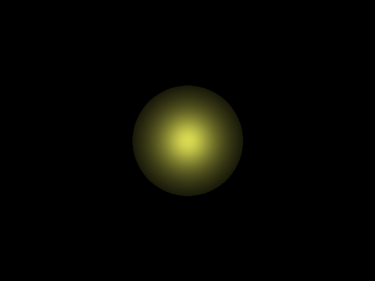

# DEMO 1                                      
This is  a minimal implementation of ray tracing with one sphere.                      

The output is like this:                                         

To save the RGBA values into an image file, I used the [lodePNG](http://lodev.org/lodepng) library.                     
To calculate the intersection between rays and sphere, I referred [this](https://www.siggraph.org/education/materials/HyperGraph/raytrace/rtinter1.htm).
