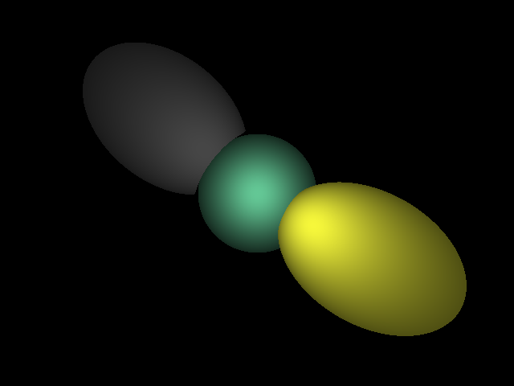

# DEMO 2                                      
This is another implementation of ray tracing, but with multiple spheres that have different depths of field.               

The output is like this:                                         
         
Comparing to demo1, the spheres on the two sides look ugly.... I know it's a rough implementation but I think it's correct.

Again, to save the RGBA values into an image file, I used the [lodePNG](http://lodev.org/lodepng) library.                     
To calculate the intersection between rays and sphere, I referred [this](https://www.siggraph.org/education/materials/HyperGraph/raytrace/rtinter1.htm).

